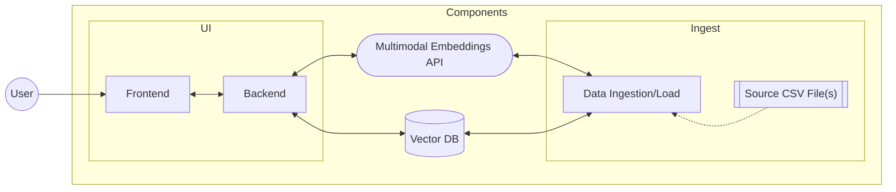

# Reference Implementation: Semantic Search with Images

## Overview

### Solution



| Component | Description |
|-----------|-------------|
| Frontend | A web application providing an interface for entering search text and/or providing an image and displaying search results. |
| Backend | A RESTful API supporting searching for sematically similar images by text or image. |
| Multimodal Embeddings API | The *Vectorize Image API* and *Vectorize Text API* provided by Azure AI Vision. |
| Vector DB | TBD |
| Data Ingestion / Load | A process triggered by CSV file(s) responsible for vectorizing the image and saving data to the data store. |
| Source CSV File(s) | Required: One or more CSV files of the specified columnar format to load or seed the data store. |

### Resources

| Resource | U.S. Region Availability | Notes |
|----------|--------------------------|-------|
| Azure AI Services (Multi-Service) *or* Computer Vision | EastUS, WestUS, WestUS2 | [[Concept Docs]](https://learn.microsoft.com/en-us/azure/ai-services/computer-vision/concept-image-retrieval) [[API Docs]](https://learn.microsoft.com/en-us/azure/ai-services/computer-vision/how-to/image-retrieval) [[API Spec]](https://learn.microsoft.com/en-us/rest/api/computervision/vectorize?view=rest-computervision-2024-02-01) |
| Azure Cosmos DB - NoSQL API | *No region restrictions* | [[Concept Docs]](https://learn.microsoft.com/en-us/azure/cosmos-db/vector-database#nosql-api) [[Vector Search (Preview) Enrollment, Policies, and Search]](https://learn.microsoft.com/en-us/azure/cosmos-db/nosql/vector-search) <br/>* DiskANN index requires early gated-preview enrollment with [this form](https://aka.ms/DiskANNSignUp). <br/>* Shared throughput databases can't use vectors search preview at this time. <br/>* Supports vector search, but if more complex search requirements need support consider using as [source to an Azure AI Search index](https://learn.microsoft.com/en-us/azure/search/search-howto-index-cosmosdb). |
| Azure Container App Environment | *No region restrictions* | [[Overview]](https://learn.microsoft.com/en-us/azure/container-apps/overview) |
| Azure Blob Storage | *No region restrictions* | [[Overview]](https://learn.microsoft.com/en-us/azure/storage/blobs/storage-blobs-introduction) |

## How to Deploy and Run in Azure

> NOTE: Update branch in URL for button below to `main` after testing but before PR (and remove this note).

[](https://portal.azure.com/#create/Microsoft.Template/uri/https%3A%2F%2Fraw.githubusercontent.com%2FAzure%2Fappinno-gbb-glam-experiments%2Fref-arch-search%2Freference-implementations%2semantic-search-for-images%2Finfra%2Fazuredeploy.json)

0. Prerequisites
    - Azure Subscription
    - Permissions to create resources in target resource group
    - CSV formatted file containing data to pre-load (see [definition](#data-ingestion-format-csv))

1. Provision Azure Resources
    - Assuming permissions for signed-in user support creating and deploying to a resource group within the current targeted subscription (for Azure CLI: `az account show` or PowerShell: `Get-AzContext`)
    - Using Azure CLI (locally or via Cloud Shell):
        ```sh
        # Create a resource group to contain resources (if not provided)
        az group create \
            --name rg-semantic-search-with-images \
            --location eastus

        # Provision resources defined within the Bicep files
        az deployment group create \
            --name SemanticSearchWithImagesDeployment \
            --resource-group rg-semantic-search-with-images \
            --template-file ./infra/main.bicep \
            --parameters TBD
        ```
    - Using PowerShell (locally or via Cloud Shell):
        ```ps1
        # Create a resource group to contain resources (if not provided)
        New-AzResourceGroup `
            -Name "rg-semantic-search-with-images" `
            -Location "East US"

        # Provision resources defined within the Bicep files
        New-AzResourceGroupDeployment `
            -Name "SemanticSearchWithImagesDeployment" `
            -ResourceGroupName "rg-semantic-search-with-images" `
            -TemplateFile ".\infra\main.bicep"
        ```

2. Drop your CSV file into the provisioned storage account for ingestion.
    - Upload via Portal, CLI, or Storage Explorer
3. Navigate to the UI Frontend

### Data Ingestion Format (CSV)

| Column (*\* required*) | Description |
|------------------------|-------------|
| objectId* | A unique identifier for the image |
| imageUrl* | A publicly-accessible URL path to the image |
| title | The title for the object |
| artist | The primary artist for the object |
| creationDate | A display date (text) representing when the object was created (e.g., "c. 1650", "1911-12", "1834") |

The first line of the file should be the header line, and the column names will be matched against those provided above. If the required columns cannot be matched, ingestion will fail. If an optional column does not match one of the predefined columns, it will be added under a metadata field for the item.

Example:
```csv
objectId,imageUrl,title,artist,creationDate,medium,dimensions
"123","https://image-host-location/objects/123.jpg","asdf","Smith, John","1974","Oil","24in. x 24in."
```

## How to Run Locally

### UI - Frontend

### UI - Backend

### Ingestion